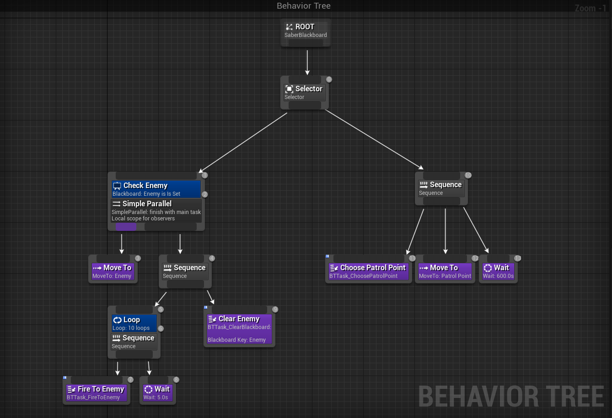

### Техническое задание:
1. Реализуйте функции сериализации и десериализации двусвязного списка, заданного следующим образом:
```
class ListNode {
    public ListNode Prev;
    public ListNode Next;
    public ListNode Rand; // произвольный элемент внутри списка
    public string Data;
}

class ListRand {
    public ListNode Head;
    public ListNode Tail;
    public int Count;
    
    public void Serialize(FileStream s) { }
    public void Deserialize(FileStream s) { }
}
```

*Алгоритмическая сложность решения должна быть меньше квадратичной.*\
*Нельзя добавлять новые поля в исходные классы ListNode, ListRand.*

#### Test `DataSet`
*Serialize:*
```
           Node*                Prev                Next                Rand                Data
    0x803a3ff4a0                   0        0x803a3ff4e0                   0              Node#1
    0x803a3ff4e0        0x803a3ff4a0        0x803a3ff520        0x803a3ff4e0              Node#2
    0x803a3ff520        0x803a3ff4e0        0x803a3ff560        0x803a3ff5a0              Node#3
    0x803a3ff560        0x803a3ff520        0x803a3ff5a0        0x803a3ff4a0              Node#4
    0x803a3ff5a0        0x803a3ff560                   0                   0              Node#5
```
*Deserialize:*
```
            Node*                Prev                Next                Rand                Data
    0x2161d176f40                   0       0x2161d2f34a0                   0              Node#1
    0x2161d2f34a0       0x2161d176f40       0x2161d2f3560       0x2161d2f34a0              Node#2
    0x2161d2f3560       0x2161d2f34a0       0x2161d2f3620       0x2161d2f36e0              Node#3
    0x2161d2f3620       0x2161d2f3560       0x2161d2f36e0       0x2161d176f40              Node#4
    0x2161d2f36e0       0x2161d2f3620                   0                   0              Node#5
```

2. Напишите ИИ для противника используя BhvTree.\
`Солдат` - сущность, которая может стрелять, перезаряжаться, отправиться в указанную точку и ждать.\
Солдат проводит патруль по зацикленному маршруту по точкам `А` и `Б`.\
По прибытии на точку солдат останавливается на 10 минут в ожидании врага. Если за 10 минут враг не появился, солдат идет на следующую точку.\
Если враг обнаружен (на любой дистанции), солдат производит 10 выстрелов с паузой 5 секунд между каждым.\
Если враг убит или произведено 10 выстрелов, солдат отправляется в следующую точку.

